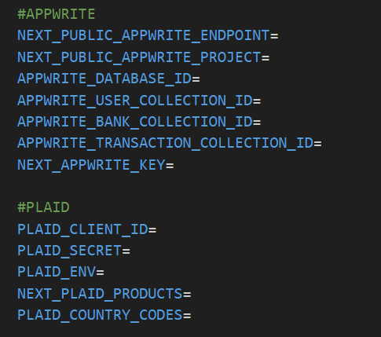

## 💳 Next.js TypeScript Banking App

# Demo
This app will be deployed a few days later on Netlify.

# Description
A modern **banking dashboard** built with **TypeScript** + **Next.js**, featuring:

- 🏦 **Add Bank Accounts** (via Plaid)
- 💸 **Transfer Funds** between accounts
- 📜 **List Transactions** in a clean, visual UI
- 📊 **Transaction Analytics** with **Chart.js**
- 🔗 Backend powered by **Appwrite**, financial data via **Plaid**  
- 🎨 UI built with **TailwindCSS** + **Shadcn**.
- 📈 Data visualization via **Chart.js**

---
## Tech Stack
- **Frontend:** Next.js 15, React.js 19 (TypeScript)
- **UI:** TailwindCSS + Shadcn UI
- **Backend:** Appwrite
- **Finance API:** Plaid (Transactions, Auth, Transfer API)
- **Charts:** Chart.js
- **Deployment:** Netlify
---
## Getting Started

### 1. Clone the Repository```bashgit clone <your-repo-url>cd your-repo-folder

### 2. Download & install node.js

### 3. Install Dependencies
npm i

### 4. Set Up Environment

a. Create .env in the root direction of the project

b. Declare the variables of your .env like this:



c. Go on Plaid, create an account, and use your sandbox keys in your .env

d. Go on AppWrite:
- Create an account.
- Create a project.
- Create a database
- Create two collections: user & bank
- In user collection, create multipe attributes: (Everything you see on authentication page)
- In bank collection, create multipe attributes: (Based on Plaid structure)
- These APIs will be used on your server-side Next.js application.

e. Come back in the project:
npm run dev


